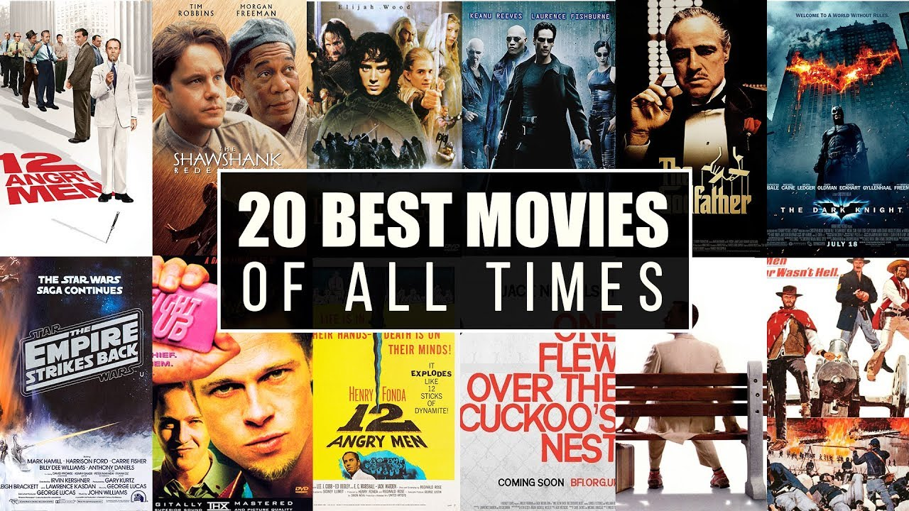
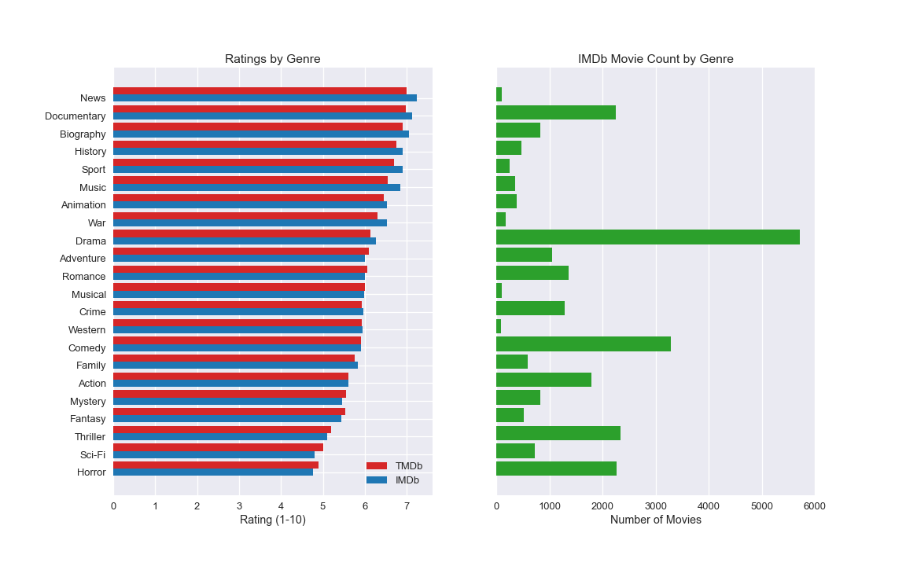
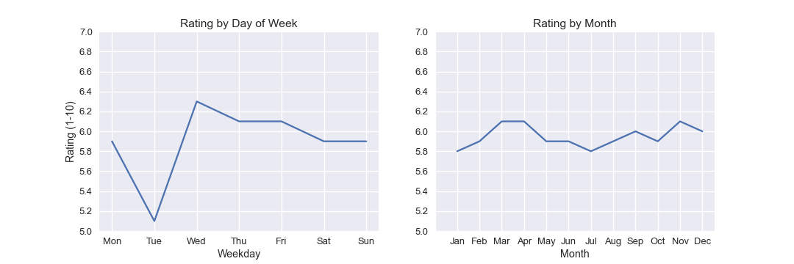
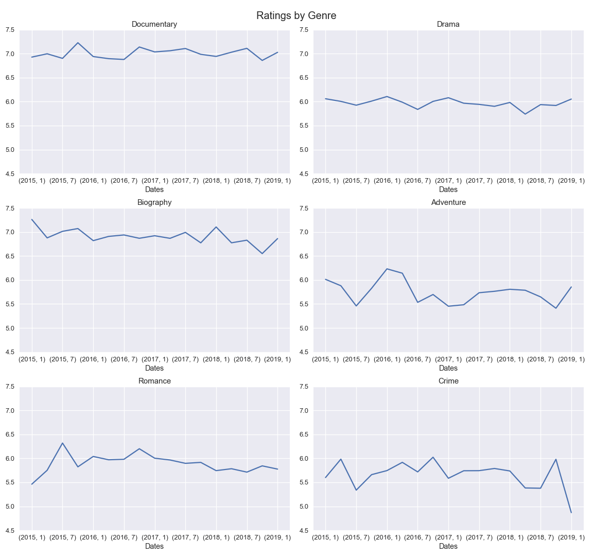
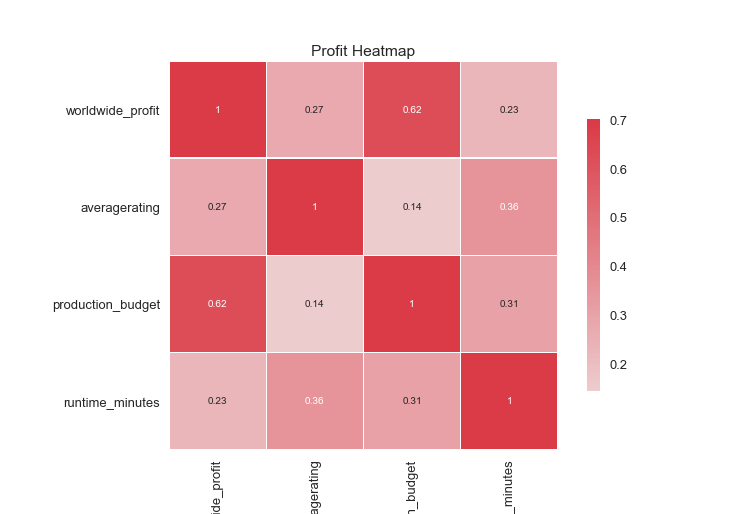

# Recommendations for Microsoft's New Movie Studio


**Author**: Martin Reyes

# Project Description:

Analyzing data to come up with recommendations for Microsoft's new movie business venture.


<hr style="border:1px solid gray"> </hr>

## Overview

This project analyzes what types of movies Microsoft should produce for their new movie studio. The analysis shows that Microsoft should focus on the Documentary, Biography, Drama, Romance, and Adventure genres. It's also shown the the best time to release these movies is at the end of the week, during March and April, and during November and December. Microsoft can use these recommendations to generate better ratings and profit.

<hr style="border:1px solid gray"> </hr>

## Business Problem





Microsoft has decided to create a new movie studio, and they need to determine what types of films to produce. Ratings generally reflect viewers' (consumer) attitude towards movie, so this will be the main subject to analyze. Each movie genre will be analyzed to see which produce the top ratings. Ratings will be compared by the timing of their release. Lastly, the top genres will be analyzed to see how each of their ratings are trending in the past five years.

<hr style="border:1px solid gray"> </hr>

## Data

Data from IMDb, TMDb, and The Numbers can be extracted to analyze movie ratings, profit, release dates, and other measures from thousands of movies. This data can be found in the "data" folder

<hr style="border:1px solid gray"> </hr>

## Methods

This project uses descriptive analysis, including categorical comparisons and analysis of trends over time. This allows for making recommendations and insights through various categories. In this case, movie genres are the categories being analyzed.

<hr style="border:1px solid gray"> </hr>

## Key Findings

### Which movie genres produce the best ratings?

The "Ratings by Genre" bar graph shows that the top, popular genres are Documentary, Biography, Drama, Romance, and Adventure. The unpopular ones are Horror, Sci-Fi, Thriller, Mystery, and Action.




### When is the best time to release movies by weekday and month?

The "Rating by Day of Week" and "Rating by Month" line charts show that the optimal time to release a movie, according to the ratings, is at the end of the week during March and April, and during November and December. 




### How are the top genres tending in recent years?

None of the top genres showed an uptrend in rating, while Crime and Biography were the only two to show a slight decline in recent years. This means ratings by genre are not likely to drastically change over time. 



### Are ratings and popularity correlated to profit?

Profit has a moderate, positive correlation with production budget, but just a weak, positive correlation with ratings and runtime.




<hr style="border:1px solid gray"> </hr>

## Conclusions

Recommendations based on the analyses:
* **For better ratings, focus on producing the top genres: Documentary, Biography, Drama, Romance, and Adventure.** Alternatively, notice the genres with. poorer ratings: Horror, Sci-Fi, Thriller, Mystery, and Action.
* **Release movies during the optimal months: March, April, November, and December.** Consider the importance and popularity of these months.
* **Expect the genres to maintain similar ratings over the next few years.**

### Next Steps

Further analyses can help better understand ratings, genre, and profitability:
* **See what other correlations exist with ratings, profit, and other metrics.** Investigate these correlations.
* **See if certain dates (like holidays) affect ratings and profit.** Grouping by genre can also help determine what types of movies to release during these dates.
* **Try to forecast and predict certain metrics like profit and revenue.** This can be done with predictive modeling or time-series analysis.

<hr style="border:1px solid gray"> </hr>

## For More Information

Please review the full analysis in [the Jupyter Notebook](./Movie_Recommendation_Full_EDA.ipynb) or the [presentation](./Movie_Recommendations_Presentation.pdf).

For any additional questions, please contact **Martin Reyes** at **martinreyes.eng@gmail.com**

## Repository Structure

```
├── data
├── images
├── Movie_Recommendation_Full_EDA.ipynb
├── README.md
├── Movie_Recommendations_Presentation.pdf
```
